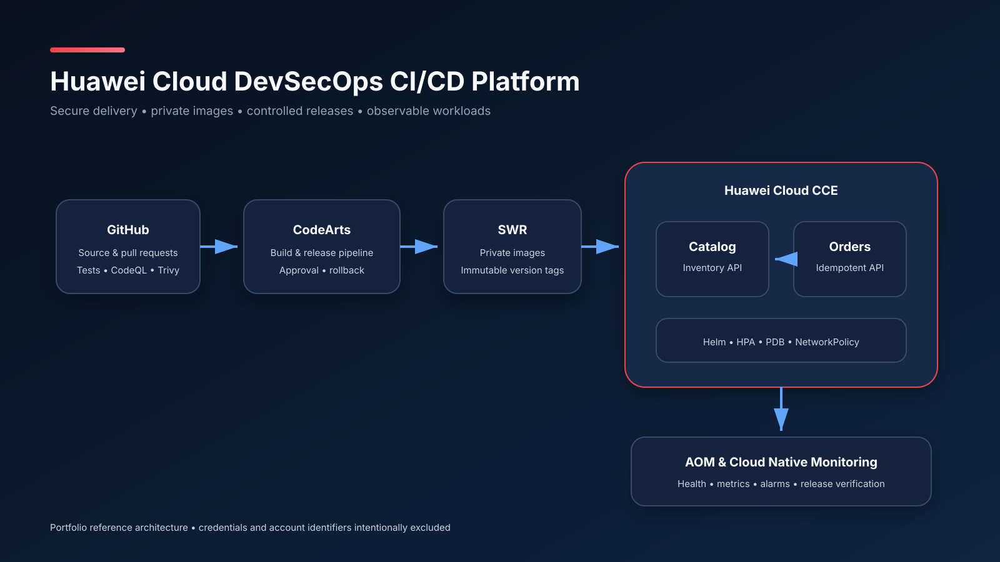
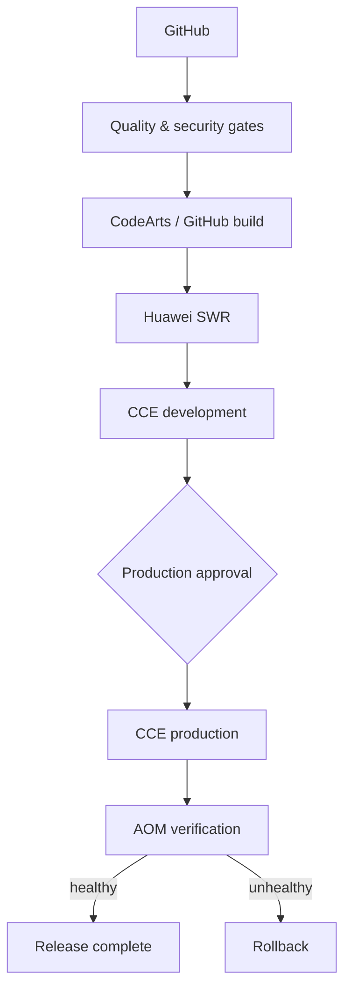

# Huawei Cloud DevSecOps CI/CD Platform

[](https://github.com/muratmiracg-dev/huawei-cloud-devsecops-cicd-platform/actions/workflows/ci.yml)
[](https://github.com/muratmiracg-dev/huawei-cloud-devsecops-cicd-platform/actions/workflows/security.yml)
[](https://www.python.org/)
[](LICENSE)



## Project overview

This portfolio project demonstrates a production-oriented DevSecOps delivery
platform for containerized microservices on Huawei Cloud. It combines public,
reviewable source control with automated quality and security gates, private SWR
image distribution, controlled CCE releases, and AOM operational verification.

The reference application contains two FastAPI services:

- **Catalog Service** — product catalog and inventory reservation
- **Orders Service** — idempotent order creation and catalog integration

The application is intentionally compact. The primary engineering outcome is the
secure and repeatable path from commit to monitored cloud release.

> **Current status:** the application, automated tests, Docker definitions, Helm
> chart, Terraform configuration, CI workflows, and operational documentation
> are included. Huawei Cloud deployment evidence remains intentionally unclaimed
> until account-side SWR, CCE, CodeArts, and AOM execution is completed.

## Business and engineering problem

Manual releases create inconsistent environments, slow feedback, weak audit
trails, credential exposure risk, and unreliable rollback. This project addresses
those problems with:

- automatic checks on every pull request
- pinned dependency lock files across local, CI, and container environments
- test coverage and configuration validation
- vulnerability, secret, and static analysis gates
- immutable private container images
- environment-specific Helm configuration
- protected production approval
- atomic deployment and rollback
- health, latency, error, and saturation monitoring

## Architecture



Detailed runtime and delivery views are available in
[`docs/architecture.md`](docs/architecture.md).

## Technology stack

| Layer | Technology |
|---|---|
| Application | Python 3.12, FastAPI, SQLAlchemy, PostgreSQL |
| Tests | Pytest, coverage, HTTPX/TestClient |
| Containers | Docker, Docker Compose |
| CI | GitHub Actions, Ruff, CodeQL, Trivy |
| Huawei delivery | CodeArts Build, Pipeline, Deploy |
| Registry | Huawei Cloud SWR |
| Orchestration | Huawei Cloud CCE, Kubernetes |
| Packaging | Helm 3 |
| Infrastructure | Terraform Huawei Cloud Provider |
| Observability | AOM, Cloud Native Cluster Monitoring, Prometheus metrics |
| Performance | k6 |

## Delivery pipeline

| Trigger | Pipeline behavior |
|---|---|
| Pull request | lint, format, tests, coverage, Helm, Terraform, security |
| Push to `main` | repeat gates and protect the release baseline |
| Manual release | build, scan, SWR push, CCE Helm deployment |
| Production environment | required approval when configured in GitHub/CodeArts |
| Failed Helm upgrade | atomic rollback |

Initial quality objectives:

- test coverage at or above 75%
- zero unaccepted high or critical scan findings
- zero committed secrets
- p95 API latency below 500 ms during the reference load test
- HTTP failure rate below 1% during the reference load test
- rollback completed within five minutes

These are project acceptance targets rather than production guarantees.

## Quick start

### 1. Prepare the environment

Windows PowerShell:

```powershell
.\scripts\bootstrap.ps1
.\scripts\verify.ps1
```

Linux or macOS:

```bash
chmod +x scripts/*.sh
./scripts/bootstrap.sh
make verify
```

### 2. Run the full local platform

```bash
cp .env.example .env
docker compose up --build -d
python scripts/smoke_test.py
```

OpenAPI:

- Catalog: `http://localhost:8001/docs`
- Orders: `http://localhost:8002/docs`

Metrics:

- Catalog: `http://localhost:8001/metrics`
- Orders: `http://localhost:8002/metrics`

### 3. Create a product

```bash
curl -X POST http://localhost:8001/api/v1/products \
  -H "Content-Type: application/json" \
  -d '{"sku":"CLOUD-001","name":"Cloud Native Hoodie","price":"79.90","stock":25}'
```

### 4. Create an idempotent order

```bash
curl -X POST http://localhost:8002/api/v1/orders \
  -H "Content-Type: application/json" \
  -H "X-Idempotency-Key: checkout-session-0001" \
  -d '{"product_id":1,"quantity":1}'
```

## Kubernetes and Helm

The Helm chart includes:

- non-root workloads
- read-only container root filesystems
- dropped Linux capabilities
- liveness and readiness probes
- CPU and memory requests/limits
- HorizontalPodAutoscaler
- PodDisruptionBudget
- NetworkPolicy
- optional ingress
- separate development, staging, and production values
- references to an existing Kubernetes Secret

Example render:

```bash
helm lint deploy/helm/commerce-platform
helm template commerce-platform deploy/helm/commerce-platform \
  --namespace commerce-prod \
  --values deploy/helm/commerce-platform/values-prod.yaml
```

See [`docs/deployment-guide.md`](docs/deployment-guide.md) before deploying.

## Huawei Cloud integration

Terraform covers the core VPC, subnet, CCE, node-pool, and SWR resources.
Region-specific values must be verified before applying:

```bash
cd infra/terraform
cp terraform.tfvars.example terraform.tfvars
terraform init
terraform validate
terraform plan
```

The Huawei-native release option uses:

```text
GitHub → CodeArts Check/Build/Pipeline → SWR → CCE → AOM
```

Setup requirements are documented in
[`docs/codearts-setup.md`](docs/codearts-setup.md).

## Security model

- no real Secret manifests
- no Huawei Cloud AK/SK values
- no kubeconfig files
- no Terraform state
- encrypted CI/CD credential stores
- private SWR repositories
- least-privilege service accounts
- automated CodeQL and Trivy gates
- protected production environment

Read [`SECURITY.md`](SECURITY.md) and
[`docs/threat-model.md`](docs/threat-model.md) for the full controls and residual
risks.

## Repository structure

```text
.
├── services/                FastAPI catalog and orders services
├── deploy/helm/             environment-aware Kubernetes package
├── infra/terraform/         Huawei Cloud infrastructure as code
├── observability/           AOM plan and Prometheus discovery examples
├── codearts/                Huawei-native release design
├── tests/load/              k6 performance scenario
├── scripts/                 Windows and Linux developer automation
├── docs/                    architecture, deployment, security and runbooks
└── .github/                 CI, security, release and governance workflows
```

## Validation

The local validation command is:

```bash
make verify
```

It checks:

- Ruff lint
- Ruff formatting
- Pytest behavior
- configured test-coverage threshold

GitHub CI additionally validates:

- Docker Compose configuration
- Helm chart rendering
- Terraform syntax/provider configuration
- Trivy security results
- CodeQL analysis

## Operational documentation

- [Architecture](docs/architecture.md)
- [Local development](docs/local-development.md)
- [Huawei Cloud deployment](docs/deployment-guide.md)
- [CodeArts setup](docs/codearts-setup.md)
- [AOM alarm plan](observability/aom/alarm-plan.md)
- [Rollback runbook](docs/rollback-runbook.md)
- [Incident response](docs/incident-response.md)
- [Threat model](docs/threat-model.md)
- [Evidence checklist](docs/project-evidence.md)

## Roadmap

- [ ] Deploy the development release to Huawei CCE
- [ ] Capture sanitized SWR, CCE, CodeArts, and AOM evidence
- [ ] Add managed schema migrations
- [ ] Add signed-image verification and admission policy
- [ ] Move Terraform state to a protected remote backend
- [ ] Add canary release traffic analysis
- [ ] Publish the executive project report and demo

## Author

**Murat Miraç Gedik**

Huawei Cloud DevOps Bootcamp participant with hands-on experience in Docker,
SWR, CCE, Kubernetes YAML, Secret/ConfigMap, persistent storage, and AOM-based
operations monitoring.
