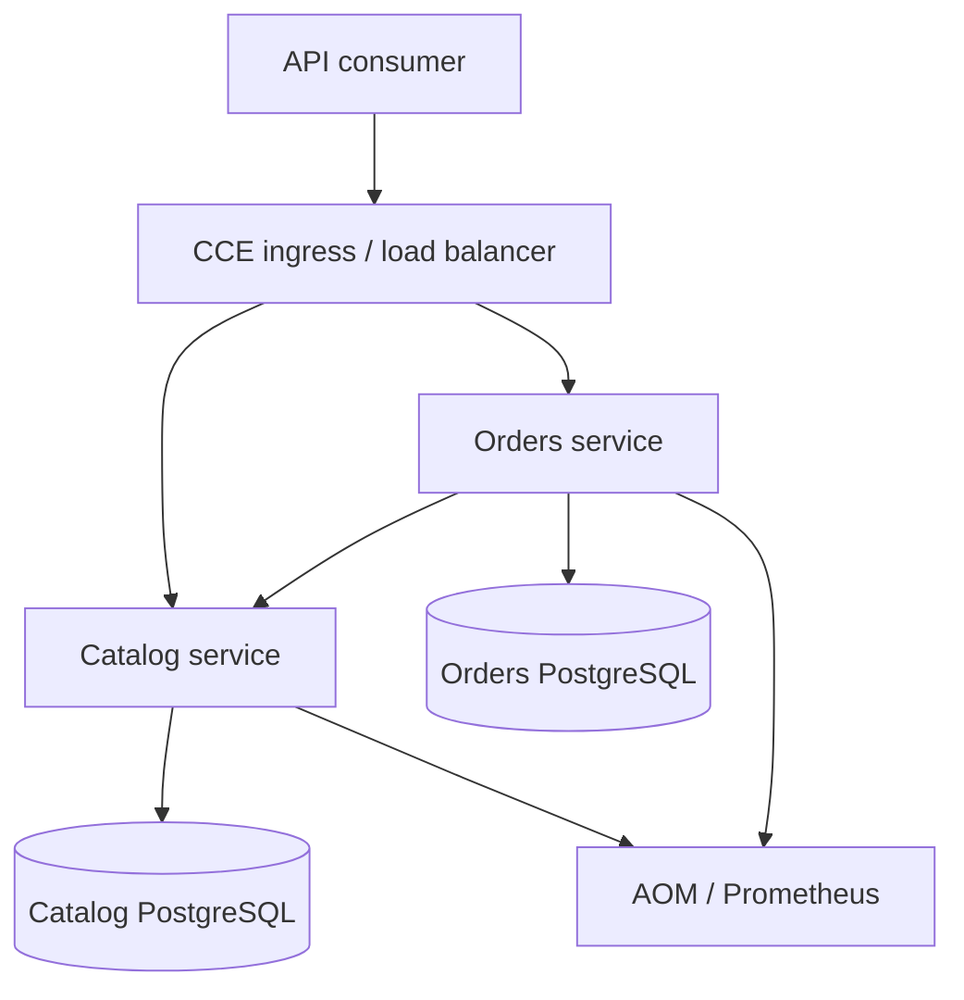
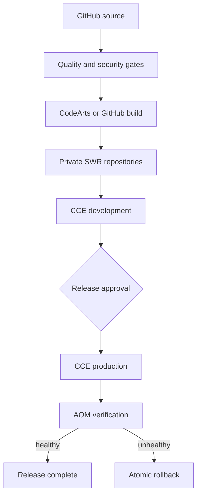

# Architecture

## Runtime view

## Delivery view

## Design decisions

- GitHub is the public, reviewable source-of-truth.
- CodeArts is the Huawei-native production release option.
- Docker images are immutable and stored privately in SWR.
- Helm provides repeatable environment-specific releases.
- Database credentials are referenced from an existing Kubernetes Secret.
- Workloads run as a non-root user with a read-only root filesystem.
- NetworkPolicy limits inbound and outbound workload traffic.
- AOM and Prometheus-compatible metrics provide operational feedback.

## Environment separation

| Environment | Namespace | Deployment | Purpose |
|---|---|---|---|
| Development | `commerce-dev` | automatic | fast integration feedback |
| Staging | `commerce-staging` | automatic after gates | production-like validation |
| Production | `commerce-prod` | protected approval | controlled release |

